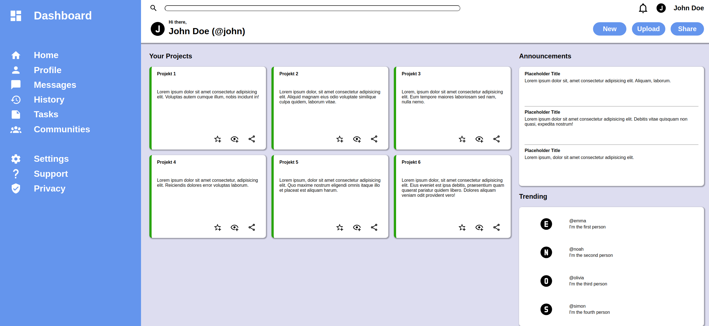

# 📊 Admin Dashboard

This project is part of **The Odin Project's JavaScript curriculum**, where I created an **Admin Dashboard** for managing users and other administrative tasks. The goal was to practice HTML and CSS by building a clean and functional interface.

## 🌟 Features

- A well-structured layout for displaying user information.
- A navigation sidebar for easy access to different sections.
- Responsive design elements (though not fully mobile-optimized).
- A consistent color scheme and typography for improved user experience.
- SVG Files as Icons

## 🚀 Technologies Used

- **HTML5**: For structuring the dashboard layout and content.
- **CSS**: For styling the dashboard and ensuring a cohesive design.

## 📸 Preview

You can view the Admin Dashboard here: [Live Demo](https://mrswizzer.github.io/odin-admin-dashboard)

## 💡 Learning Outcomes

Through this project, I practiced the following skills:

- Structuring a dashboard layout using HTML.
- Applying CSS styles for a visually appealing interface.
- Organizing content effectively to enhance user navigation.
- Working with SVGs as Icons

---

## 🔗 Acknowledgments

This project was built as part of [The Odin Project](https://www.theodinproject.com/)'s curriculum.
